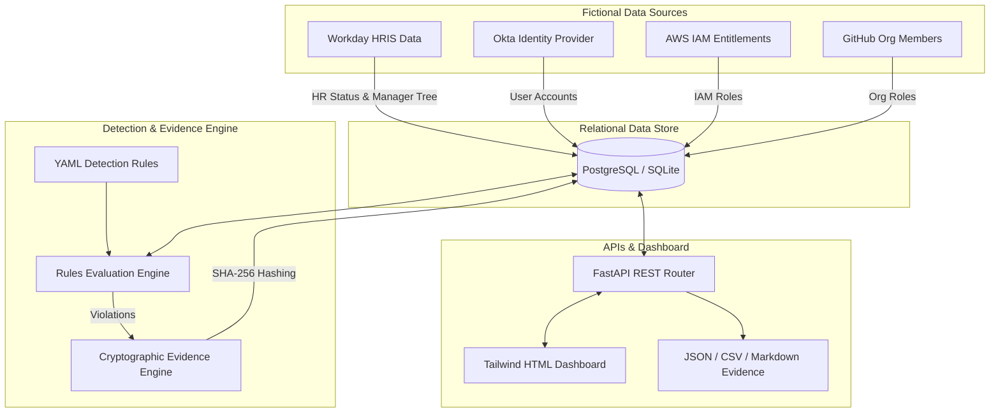

# GRC Control Automation Engine — Privileged Access Review

> ⚠️ **PORTFOLIO PROTOTYPE DISCLAIMER**: This repository is a fictional GRC Engineering portfolio project built to demonstrate how manual compliance controls can be transformed into continuous, automated, evidence-producing security controls. It is NOT a production security system.

---

## Executive Summary

Traditional GRC relies on manual, spreadsheet-driven quarterly access reviews that take weeks to compile, suffer from high error rates, depend on stale data, and fail silently.

This project implements a **lightweight, local-first GRC Control Automation Engine** built with Python 3.11, FastAPI, SQLAlchemy, Pydantic, and SQLite/PostgreSQL. It ingests identity, account, and entitlement data, evaluates 8 YAML detection rules, tracks exceptions, generates SHA-256 cryptographically hashed audit evidence, and presents compliance telemetry via interactive REST APIs and a web dashboard.

---

## 🏗️ Architecture Overview



---

## ⚡ Tech Stack

- **Core Engine**: Python 3.11+, FastAPI
- **Database & ORM**: SQLite (default local) / PostgreSQL, SQLAlchemy 2.0
- **Validation**: Pydantic v2 & Pydantic-Settings
- **Rule Engine**: PyYAML
- **Test Suite**: Pytest & Httpx (30 passing tests)
- **Containerization**: Docker & Docker Compose
- **Dashboard**: TailwindCSS HTML Dashboard

---

## 🚀 Quickstart & Local Execution Guide

Follow these simple steps to run the working prototype locally:

### 1. Clone & Set Up Environment
```bash
# Clone the repository
git clone https://github.com/your-username/04-grc-control-automation.git
cd 04-grc-control-automation

# Create copy of environment configuration
cp .env.example .env
```

### 2. Install Dependencies
```bash
python -m pip install -r requirements.txt
```

### 3. Run Test Suite (Unit & API Integration Tests)
```bash
python -m pytest -v
```
*(All 30 unit & integration tests will execute and pass).*

### 4. Seed Database & Start Web Server
```bash
# Seed initial test data and start FastAPI server
python -m uvicorn app.main:app --reload --host 127.0.0.1 --port 8000
```

### 5. Access Dashboard & OpenAPI Specs
- **Interactive Dashboard**: Open [`http://127.0.0.1:8000/dashboard`](http://127.0.0.1:8000/dashboard) in your browser.
- **OpenAPI Swagger Specs**: Open [`http://127.0.0.1:8000/docs`](http://127.0.0.1:8000/docs).

---

## 🛡️ Detection Rules Catalog

The engine continuously evaluates 8 automated YAML rules:

| Rule ID | Rule Name | Severity | Condition Summary | Default SLA |
| :--- | :--- | :--- | :--- | :--- |
| `RULE-001` | Terminated User Retains Privileged Access | CRITICAL | User `hr_status == 'terminated'` with active admin role | 24 Hours |
| `RULE-002` | Privileged Account Has No Owner | HIGH | Human admin account unlinked to HR identity | 72 Hours |
| `RULE-003` | Privileged Access Exists Without Recent Review | HIGH | Admin access unreviewed > 90 days | 5 Days |
| `RULE-004` | Privileged Access Inconsistent With Job Role | HIGH | Non-technical department user holding cluster-admin | 3 Days |
| `RULE-005` | Inactive Privileged Account | MEDIUM | Admin account with no logins > 30 days | 7 Days |
| `RULE-006` | Privileged Access Granted Without Approval | HIGH | Admin entitlement lacking Jira ticket reference | 2 Days |
| `RULE-007` | Manager Failed to Complete Review | MEDIUM | Assigned manager review status is OVERDUE | 24 Hours |
| `RULE-008` | Service Account Lacks Documented Owner | HIGH | Service account holding admin role without owner email | 3 Days |

---

## 🔒 Audit Evidence & Cryptographic Hashing

For every violation, exception, or action, the engine produces machine-readable audit evidence stamped with a **SHA-256 cryptographic hash**:

### Export Formats
- **JSON Export**: `GET /api/v1/evidence/export?format=json`
- **CSV Export**: `GET /api/v1/evidence/export?format=csv`
- **Markdown Audit Report**: `GET /api/v1/evidence/export?format=markdown`

---

## 📚 Technical Documentation Index

Detailed architectural and GRC engineering documentation is available in the [`docs/`](docs/) directory:

- 📄 [`docs/architecture.md`](docs/architecture.md) — System Architecture, Mermaid Diagrams, and Automation Scope
- 🎯 [`docs/control-objective.md`](docs/control-objective.md) — Tripartite Control Objectives (Compliance, Security, Business)
- 📋 [`docs/detection-rules.md`](docs/detection-rules.md) — Detailed Detection Rule Specifications
- 🔒 [`docs/evidence-model.md`](docs/evidence-model.md) — Audit Evidence Hashing & Payload Schema
- ⚠️ [`docs/residual-risk.md`](docs/residual-risk.md) — Technical Residual Risk Matrix & Mitigations
- 🗺️ [`docs/implementation-roadmap.md`](docs/implementation-roadmap.md) — 3-Phase Engineering Rollout Roadmap
- 📄 [`docs/privileged_access_review_architecture.md`](docs/privileged_access_review_architecture.md) — Complete 14-Part GRC Engineering Technical Design Document

---

## 📄 License & Portfolio Notice

This project is released under the MIT License for educational and portfolio demonstration purposes. All company names, employee names, emails, and entitlements used in this project are strictly fictional.
